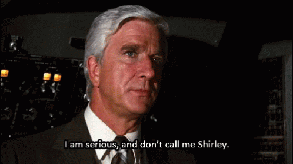
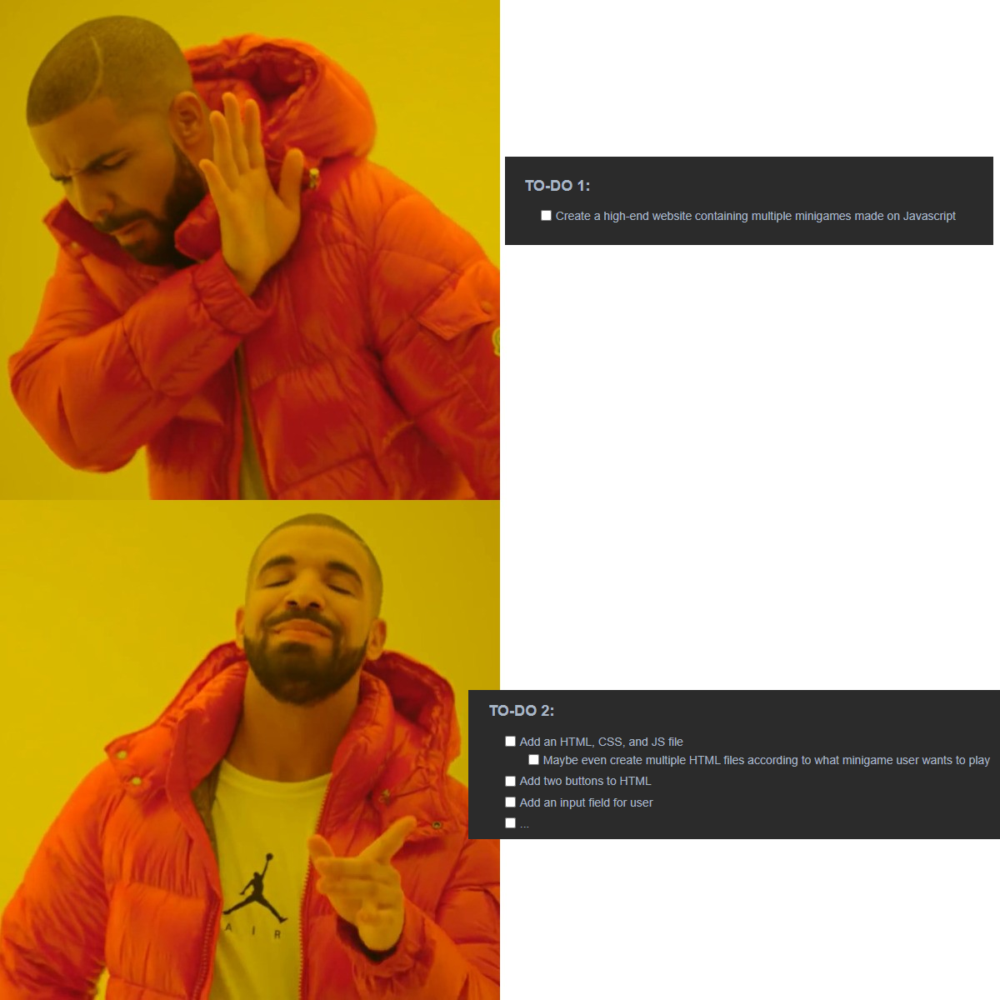
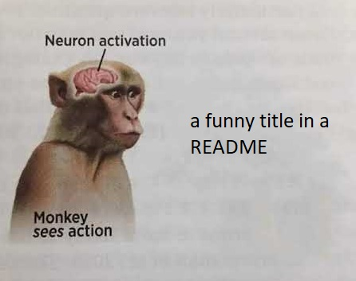
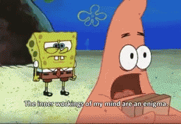

# How to write a README
##### A README by Besart Elezi, licensed doctor/professor in READMEIOLOGY at the Institute of Becode
###### Authenticity of the license in question is still under investigation.

After getting a lot of praise for the way I write my READMES, I thought some people might like it if I could give a little insight on the way I write them.
For that I have made both a presentation, which you can find [here](https://www.youtube.com/watch?v=W8MbyfCrrWQ), and a README, which in case you haven't noticed, you are reading right now!
I have split up everything in topics to make it more easily understandable.

These are the following topics that I will discuss:
* Lesson 1: Why should I give a heck about READMES?
* Lesson 2: Storytelling, have some fun with it
* Lesson 3: Introductory lesson to Introductions
* Lesson 4: The First Step
* Lesson 5: Significance of To-Do's
* Lesson 6: Titles
* Lesson 7: In the Middle but I can't find Malcolm - Middle Parts of your README

* Lesson 8: Finally, The Final Finale
  * How to end your README
    * Short Summary
    * Final Thoughts
    * What did I learn?
    * What was something that stood out in this project
    * What am I proud of?

---

## Lesson 1: Why should I give a heck about READMES?
There are quite a few advantages to spend some of your time on writing a README instead of coding.
But to me, the biggest advantage is definitely that coding just goes way, WAY smoother when you also have a clear and concise README.
I believe that people learn by repetition.
So if you learned something new on a project that you're working on, you might want to write that in your README.
The process of putting the newly learned stuff into words, to break it down into small steps, really helps you understand it better on a more fundamental level.

Writing READMES is also a skill that **every developer needs**.
READMES need to explain what your project is about and how it works.
Making it clear and understandable for others is the bare minimum.
Code can easily be overwhelming, no matter how many years of experience you have.
But we need to be able to write a README so that even when a beginner developer joins the team, they can understand what your project is about, how it works and why it's needed.

You should also never forget that your Github is public for anyone to see, this includes future employers.
So when they see you writing some spicy READMES, adding some crispy comments to your code and have a clean Git behaviour, they **will** take notice of that.
And if there's one thing that watching hours and hours of anime have taught me, it's that being noticed by your employer-senpai is the way to go!

## Lesson 2: Storytelling, have some fun with it
Speaking (or writing?) about anime, let's talk about storytelling.
Storytelling is, according to Google: 
````
Storytelling is the act of telling or writing stories, or narratives. 
Typically, stories are told for entertainment, for informational purposes, or for educational purposes. 
Storytelling is universal to the human experience.
````
But according to me, it's much more than a bunch of words some nerds in a lab decided that would fit the description of another word.
To put it in the most simple way imaginable, storytelling is just saying stuff in a way that another person would actually listen to.
If I want someone to understand something, I won't throw some mumbo jumbo difficult words at them and hope they'll understand.
I try to explain it in a fun, **and simple** way.

So when you're writing your READMES, always ask yourself the following question:
"Am I having fun writing this, and would I ever want to read this again?"
If what you're writing is too boring, add a lil spice to it.
Create some funny titles, add a gif, heck, explain your code by using an analogy of your favourite book/tv-show/anime.

But most important of all, keep it short and sweet.
Because, as a great man once said: 


###### P.S. I have never watched The Office and I do not intend to ever watch it, love this quote though.

## Lesson 3: Introductory lesson to Introductions
Speaking of keeping things short and simple, let's talk about introductions!
When I create a repository, the very first thing I do is write a short introduction about the current project.
In there I add what my current goals are (what do I want to learn from this project, why am I creating this project).
And I add what the project exactly is.

The purpose of an introduction is to explain to the reader what the heck is going on.
After they read the introduction, they need to understand what the project is and they need to be able to follow along the rest of the README.

## Lesson 4: The (second) First Step
This step is an optional one, according to the project.
Because once you're done with writing the intro, it's time do some research on the topic of your project.
I'd like to explain this step by using an example.
In the past, I created a blackjack game on Javascript.
But I did not know the rules or how to play it.
So before I even made an HTML file, I looked for all the rules blackjack has, and wrote them in my README.
Then I spent the next 15-20 minutes just playing blackjack online, while keeping all the rules I wrote down in the back of my head.

And I can say with absolute certainty that if I didn't do the research at the very start I would've not been able to finish this assignment in time.
Having everything written down, as clear as possible, in my own words, made me understand the game 100%.
Once I know the rules of the game, I also know how to program those rules.
Like I mentioned earlier, most of the work for a project is done in the planning, and that's done in the README!


## Lesson 5: Significance of To-Do's
To-Do lists are the bread and butter of my READMES.
I would not be able to function as a developer (or a human being) without them.
Now I know what you're thinking: "Surely you can't be serious, TO-DO lists aren't **that** important".
And to that I have but one thing to say:



Coding can get extremely overwhelming and complex.
This is especially true for big projects and group projects.
I will now present you with two TWO-DO lists (not a typo but a pun) and you will decide which one you'd rather clear.

### TO-DO 1:
- [ ] Create a high-end website containing multiple minigames made on Javascript

### TO-DO 2:
- [x] Add an HTML, CSS, and JS file
  - [x] Maybe even create multiple HTML files according to what minigame user wants to play
- [x] Add two buttons to HTML
- [ ] Add an input field for user
- [ ] ...

As you can see, the second list is less intimidating and more clear on what needs to happen.
Make it yourself as easy as possible, split up big scary projects into very small and very attainable goals.
Not only does it make coding for yourself easier, this also comes in handy when working in groups.
When everyone has their own small goals, it's easier to communicate what exactly needs to happen.

Splitting up a big scary project into small attainable goals is skill that is very essential to developers.



## Lesson 6: Titles
Titles gotta do what titles gotta do.
And that's to perfectly represent what goes on in that segment of text.
It makes the entire README more structured, less exhausting to read through, and when someone needs to find a specific piece on information, they can find it way faster!

And if you can make a funny title, that's even better!
Here are some Besart-Cerficied tips to make some funny titles (9/10 times I use these):
* Add a pun in the title, gets 'em every time
* Make up your own acronyms
  * Oh you're working on PHP? **OR** are you working on a Pretty Huge Problem?
* Don't overthink!
  * If you can't come up with anything funny, that's okay too.
  Sometimes the very first thought that comes up to you while thinking of a title works just perfectly

Here I have used some very refined technology to recreate what goes on in the inner machinations of a readers mind when seeing a funny title.



## Lesson 7: In the Middle but I can't find Malcolm - Middle Parts of your README
This lesson will be split up into two parts: 'What subjects should you write about' and 'Some general writing tips'.

### Subject Matter - What should I write about?
I'll start out by giving out a tip that's very dear to me: "When in doubt, write it out!".
This means that whenever you're stuck, you don't know what to do next or you're not sure what's going wrong with your code, you just write everything out.
When you've written everything out, you get a clearer understanding of all the steps you took until that point.
So the next step you should take becomes more clear.

The most basic subjects you should write about are the following:
* What went wrong, and how did I solve it
* What are you working on and how do you plan to tackle any issues
* What's a feature or a piece of code you're proud of
* What are some fun features I'd like to add, if I have enough time
* And much more!

In general, you can never run out of things to write in your README.
Even if you're unsure if what you're writing is "good" or "necessary", ya just gotta write it anyway.
Just like coding, writing READMES is a learning experience.
And you can't learn by doing nothing, you learn by making a lot of mistakes.

### General Writing Tips
The most important tip is that you need a nice layout and good structure.
Developers are lazy people, we want to find the information we want as fast as possible.
A good structure helps with that.
This means adding clear titles and having only the necessary text present in that segment about that subject.

Another tip is to also switch up the way you start sentences.
If every sentence starts the same it can get boring and repetitive quickly.
* "I did this..."
* "I did that..."
* "I did another thing..."

Using words like "first, then, afterwards, ..." to describe what you were doing is the way to go.

Another fun thing to know, is that some IDE's have a built-in spelling checker.
You can use this to your advantage to make sure there are no spelling errors in your README.

Since READMES are generally made in markdown, make sure to visit [this repository](https://github.com/Hub-Mo/MDcheatsheet), where you can find a handy markdown cheatsheet.
Mastering markdown to make your README look as spicy as possible is also a fine way to go!

## Lesson 8: Finally, The Final Finale
And now, here are some guidelines on how to end your README.
I like to start out by giving a very short summary.
"Some stuff happened, the code made me cry, the crying taught me that it's important to accept your emotions so this experience made me a better human being", or something like that.
Just summarize everything in the simplest way possible, by this point your reader should understand everything regarding the project.

Some things that are also worth writing in the final segment of your README are:
* What did I learn?
* What was something that stood out in this project
* What am I proud of?

And once that's done, you can git add, git commit, and git push that README straight into the eye-sockets of those lucky enough to read it.

###### And one more last tip, it's always fun to end things with a funny gif/meme!

