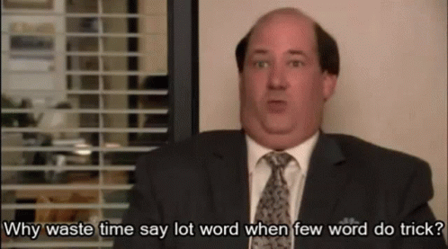

# How to write a README
##### A README by Besart Elezi, licensed doctor/professor in READMEIOLOGY at the Institute of Becode
###### Authenticity of the license in question is still under investigation.

After getting a lot of praise for the way I write my READMES, I thought some people might like it if I could give a little insight on the way I write them.
For that I have made both a presentation, which you can find [here](https://www.youtube.com/watch?v=W8MbyfCrrWQ), and a README, which in case you haven't noticed, you are reading right now!
I have split up everything in topics to make it more easily understandable.

These are the following topics that I will discuss:
* Lesson 1: Why should I give a heck about READMES?
  * Learning through repetition
  * Makes coding/programming **a lot** easier
  * GitHub is the spiciest portfolio there is
  * A skill that every developer needs
    * Difference between professional READMES and current READMES
* Lesson 2: Storytelling, have some fun with it
  * 
* Lesson 3: Introductory lesson to Introductions
* Lesson 4: The First Step
* Do I need to do some research about the Topic?
  * Example Blackjack
* 
* Lesson 5: Significance of To-Do's
* Lesson 6: Titles
  * Just puns honestly
* Lesson 7: In the Middle but I can't find Malcolm - Middle Parts of your README
  * What subjects should you write about
  * Some general writing tips
  * 
* Lesson 8: Finally, The Final Finale
  * How to end your README
    * Short Summary
    * Final Thoughts
    * What did I learn?
    * What was something that stood out in this project
    * What am I proud of?

---

## Lesson 1: Why should I give a heck about READMES?
There are quite a few advantages to spend some of your time on writing a README instead of coding.
But to me, the biggest advantage is definitely that coding just goes way, WAY smoother when you also have a clear and concise README.
I believe that people learn by repetition.
So if you learned something new on a project that you're working on, you might want to write that in your README.
The process of putting the newly learned stuff into words, to break it down into small steps, really helps you understand it better on a more fundamental level.

Writing READMES is also a skill that **every developer needs**.
READMES need to explain what your project is about and how it works.
Making it clear and understandable for others is the bare minimum.
Code can easily be overwhelming, no matter how many years of experience you have.
But we need to be able to write a README so that even when a beginner developer joins the team, they can understand what your project is about, how it works and why it's needed.

You should also never forget that your Github is public for anyone to see, this includes future employers.
So when they see you writing some spicy READMES, adding some crispy comments to your code and have a clean Git behaviour, they **will** take notice of that.
And if there's one thing that watching hours and hours of anime have taught me, it's that being noticed by your employer-senpai is the way to go!

## Lesson 2: Storytelling, have some fun with it
Speaking (or writing?) about anime, let's talk about storytelling.
Storytelling is, according to Google: 
````
Storytelling is the act of telling or writing stories, or narratives. 
Typically, stories are told for entertainment, for informational purposes, or for educational purposes. 
Storytelling is universal to the human experience.
````
But according to me, it's much more than a bunch of words some nerds in a lab decided that would fit the description of another word.
To put it in the most simple way imaginable, storytelling is just saying stuff in a way that another person would actually listen to.
If I want someone to understand something, I won't throw some mumbo jumbo difficult words at them and hope they'll understand.
I try to explain it in a fun, **and simple** way.

So when you're writing your READMES, always ask yourself the following question:
"Am I having fun writing this, and would I ever want to read this again?"
If what you're writing is too boring, add a lil spice to it.
Create some funny titles, add a gif, heck, explain your code by using an analogy of your favourite book/tv-show/anime.

But most important of all, keep it short and sweet.
Because, as a great man once said: 


###### P.S. I have never watched The Office and I do not intend to ever watch it, love this quote though.

## Lesson 3: Introductory lesson to Introductions